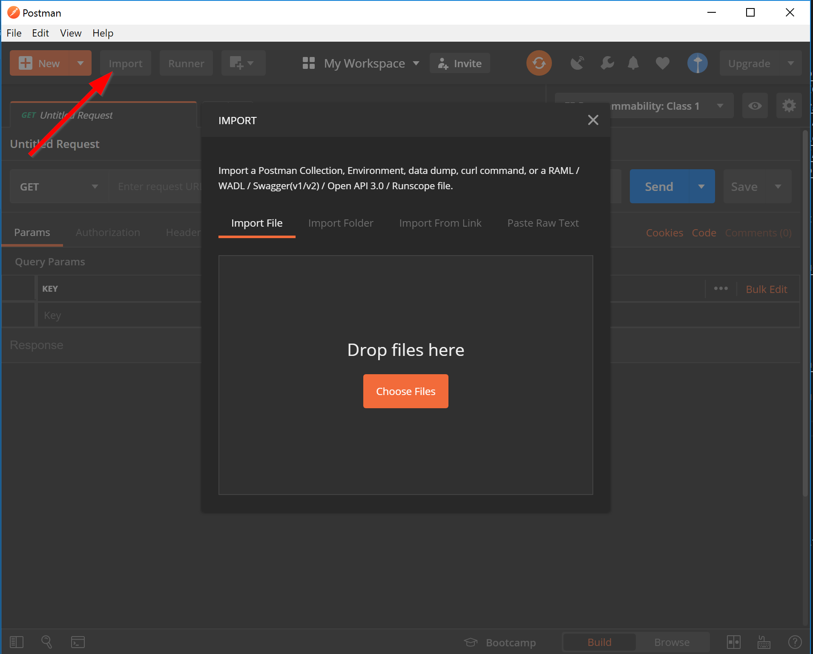
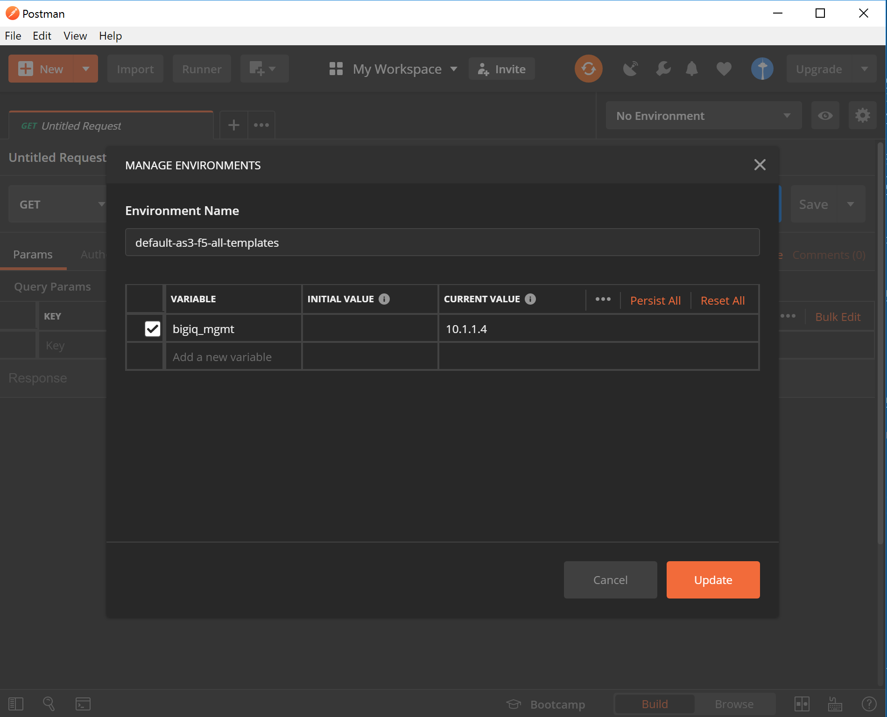
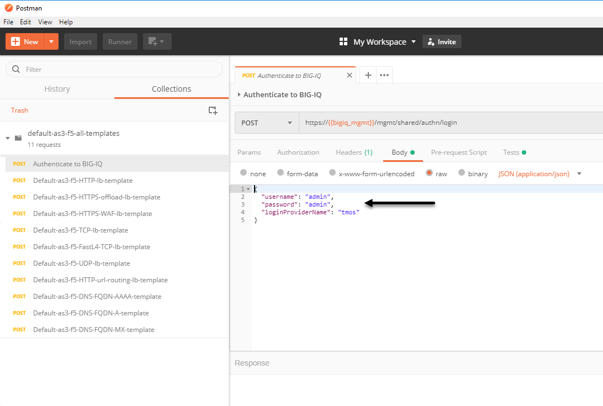
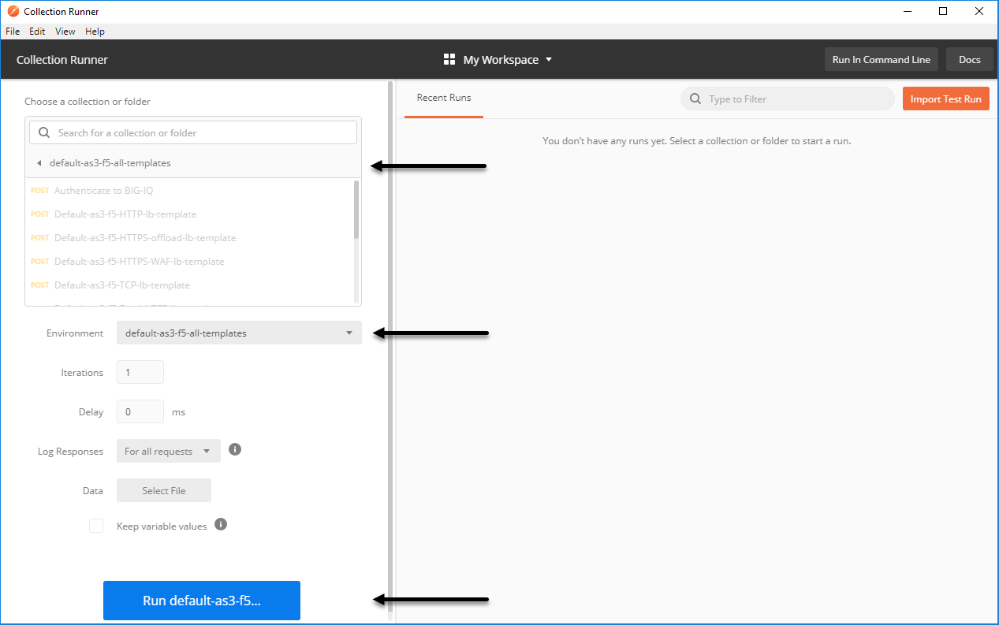
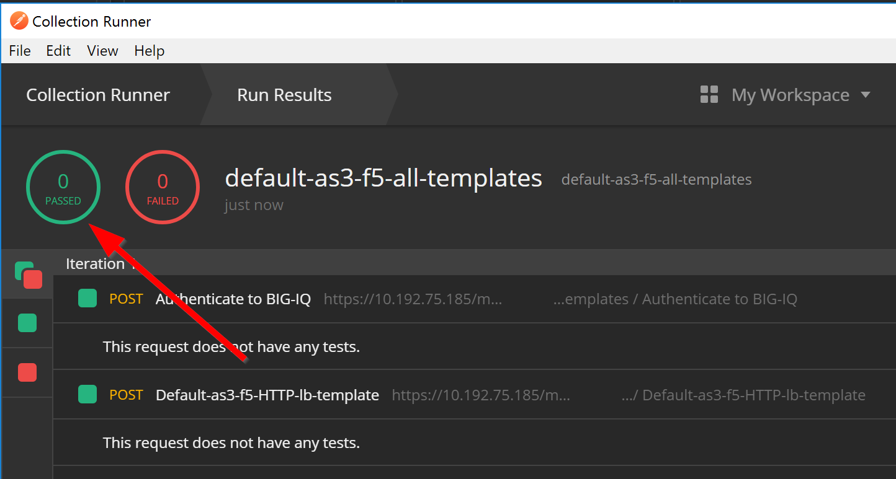
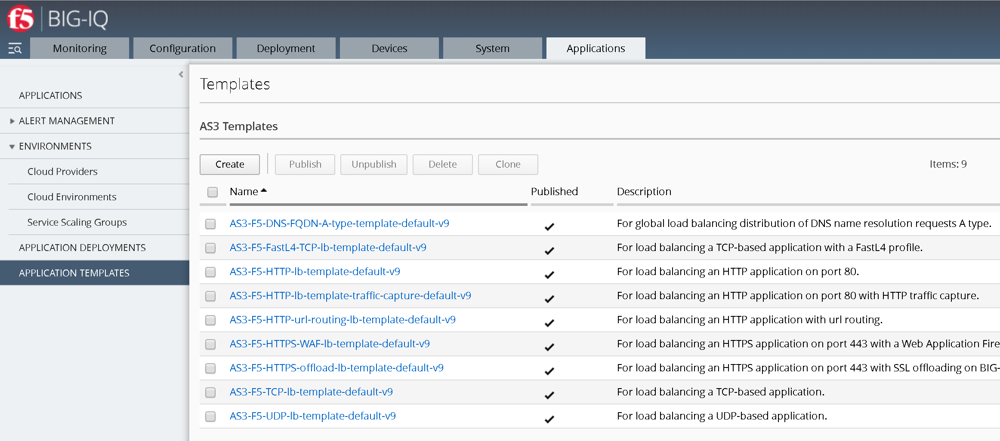

BIG-IQ Templates
================

**Note:** These templates are supported only with BIG-IQ 7.0.0 and above.

Use this API to define an [Application Services 3 Extension (AS3)](https://clouddocs.f5.com/products/extensions/f5-appsvcs-extension/latest/) template on BIG-IQ. You can use AS3 on BIG-IQ in largely the same way as on BIG-IP and described in the AS3 documentation: [Using AS3 with BIG-IQ](https://clouddocs.f5.com/products/extensions/f5-appsvcs-extension/latest/userguide/big-iq.html). With BIG-IQ, declarations use an AS3 template which is defined in BIG-IQ. For an example of an AS3 declaration that uses an AS3 template, see the AS3 documentation: [Using declarations with AS3 templates](https://clouddocs.f5.com/products/extensions/f5-appsvcs-extension/latest/userguide/big-iq.html#template). You can use the [AS3 Declare API](https://clouddocs.f5networks.net/products/big-iq/mgmt-api/v7.0.0/ApiReferences/bigiq_public_api_ref/r_as3_declare.html) to post the AS3 declaration to BIG-IP and you can use the [AS3 Deploy API](https://clouddocs.f5networks.net/products/big-iq/mgmt-api/v7.0.0/ApiReferences/bigiq_public_api_ref/r_as3_deploy.html) from BIG-IQ to deploy an application.

You can find a list of default AS3 templates in this repository in 2 different forms:

* A Postman collection. Instructions for using these in the BIG-IQ user interface are provided below.
* A JSON file. The [BIG-IQ API documentation](https://clouddocs.f5.com/products/big-iq/mgmt-api/latest/ApiReferences/bigiq_public_api_ref/r_as3_template.html) provides instruction for using API calls to use AS3 templates.

Instructions on how to import AS3 templates using Postman
---------------------------------------------------------

1. [Install the Postman application.](https://learning.getpostman.com/docs/postman/launching_postman/installation_and_updates/)

2. Use the Postman Import feature to import  two Postman collections.
   1. Click the **Import** button.
   1. Click **Import From Link**.
   1. Paste in the following for the first collection: `https://raw.githubusercontent.com/f5devcentral/f5-big-iq/7.0.0/f5-appsvcs-templates/default/postman/default-as3-f5-all-templates.postman_collection.json` and then click **Import**.
   1. Repeast the last 3 sub-steps, but this type paste in the following for the second collection:  `https://raw.githubusercontent.com/f5devcentral/f5-big-iq/7.0.0/f5-appsvcs-templates/default/postman/default-as3-f5-all-templates.postman_environment.json`.

3. Set your `Primary BIG-IQ CM IP address` in the Postman environment. To do this:
   1. Click the Settings icon to open the Manage Environments screen.
   1. Click `default-as3-f5-all-templates`.
   1. For the `bigiq_mgmt` variable, type the management IP address of your BIG-IQ.
   1. Click **Update**.
   1. Close the Manage Environments screen.

4. Specify the  BIG-IQ device's admin user `username` & `password`so that Postman can access it. To do this:
   1.Select the `POST` named `Authenticate to BIG-IQ`, as shown in the screen shot.
   1. On the Body tab, type:
   >"username": "admin",
   >"username": "admin",
   >"loginProviderName": "tmos",
   

5. Run the Import collection in this environment. To do this:
   1. Open the Postman runner.
   1. For the Collection, select **default-as3-f5-all-templates**.
   1. For the Environement , select **default-as3-f5-all-templates**.
   1. Click **Run default-as3-f5-all-templates**.

6. When the Post collection finishes, the result should be green status icons and  `200 OK` for each post.

7. Login to your primary BIG-IQ device and navigate to **Applications > APPLICATION TEMPLATES > AS3 Templates** and verify that the AS3 templates you imported are listed.

**Note:** Before you can a template, it must be Published (read-only).

8. For more information on how to use the template to deploy AS3 Application using the BIG-IQ, see [BIG-IQ documentation](https://support.f5.com/csp/knowledge-center/software/BIG-IQ?module=BIG-IQ%20Centralized%20Management&version=7.0.0)

Support
-------

Bugs and enhancements can be made by opening an issue within the GitHub repository.
