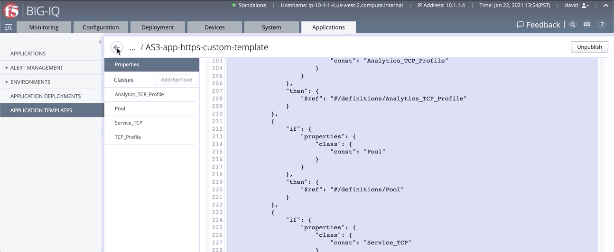

BIG-IQ AS3 Templates submitted by the Community
===============================================

Welcome to the repository for community-submitted BIG-IQ Application Services 3 (AS3) templates! 

Just like the [default AS3 templates for BIG-IQ](https://github.com/f5devcentral/f5-big-iq) — produced by the F5 product group for more common use cases—the AS3 templates listed below are meant to be installed on BIG-IQ and will be used to configure and deploy L4-L7 services on BIG-IPs being managed by your BIG-IQ. And just like the default templates, you’ll need the following components to get started:
•	BIG-IQ Centralized Management
•	Application Services 3 Extensions (AS3) installed on BIG-IQ

In addition to the software components, you’ll need to ensure that you’re running the appropriate versions—this information can be found in the template list below.

Please note that all of the templates listed below are submitted and supported by the **community** (F5 sales and customers) and may not fall under your support contract. These templates are for more specialized BIG-IQ + AS3 use cases—identified by our user community. 

To submit bugs and enhancements, you’ll need to open an issue withing the GitHub repository. 

List of AS3 Templates 
---------------------

Templates (schemaOverlay) | Version | Description | Min AS3 version | Min BIG-IQ version
------------------------- | ------- | ----------- | --------------- | ------------------
| AS3-HTTPS-offload-lb-LTM-policy-ASM-splunk-template-big-iq | v2 | For load balancing an HTTPS application on port 443 with SSL offloading on BIG-IP using existing Certificate and Key on BIG-IP, custom TCP monitor and LTM Policy with a WAF policy sending its logs to Splunk. | 3.18 | 7.1
| AS3-F5-HTTP-lb-page-load-time-template-big-iq | v1 | For load balancing an HTTP application on port 80 with Page Load Time HTTP analytics and CSPM enabled (Client side Perf Monitoring javascript injection) [more details on K13849](https://support.f5.com/csp/article/K13849). | 3.12 | 7.0
| AS3-F5-TCP-lb-built-in-profile-template-big-iq | v1 | For load balancing a TCP-based application using one of the built-in TCP profile. | 3.18 | 7.1
| AS3-F5-HTTP-lb-TCP-analytics-key-template-big-iq | v1 | For load balancing an HTTP application on port 80 with TCP analytics using a user-provided key set in an iRule. | 3.18 | 7.1
| AS3-F5-DNS-FQDN-A-type-default-monitors-template-big-iq | v1 | For global load balancing distribution of DNS name resolution requests A type using default monitors. | 3.18 | 7.1
| AS3-EPIC-BCA-HTTPS-template-big-iq | v1 | Epic BCA (Business Continuity Access) HTTPS App Services. | 3.26 | 7.1
| AS3-EPIC-BCA-FTP-template-big-iq | v1 | Epic BCA (Business Continuity Access) FTP App Services. | 3.26 | 7.1
| AS3-EPIC-EpicCare-HTTPS-template-big-iq | v1 | Epic BCA (Business Continuity Access) FTP App Services. | 3.25 | 7.1

Do you [need to upgrade AS3 on BIG-IQ](https://support.f5.com/csp/article/K54909607)?

**Note:** The AS3 naming convention for **TLS Server** and **TLS Client** differs from traditional BIG-IP terminology to better comply with industry usage, but may be slightly confusing for long-time BIG-IP users. The AS3 TLS_Server class is for connections arriving to the BIG-IP, which creates a “client SSL profile” object on the BIG-IP. The AS3 TLS_Client class if for connections leaving the BIG-IP, which creates a “server SSL profile” on the BIG-IP. See TLS_Server and TLS_Client in the Schema Reference for more information ([more tips and warnings](https://clouddocs.f5.com/products/extensions/f5-appsvcs-extension/latest/userguide/tips-warnings.html)).

How to submit a new template
----------------------------

1. Log in to your primary BIG-IQ device and navigate to **Applications > APPLICATION TEMPLATES** and under **AS3 Templates**, click on the AS3 template you want to share.

Under Template JSON in the General Properties, select all (CTRL+A) and copy (Ctrl-C) the AS3 template in JSON format.


2. Return to the previous screen, on the upper right corner, click the Import Templates link. The link opens this DevCentral GIT repository.



3. Under the **issue** tab, click on **New issue**, then **Get Started**.


4. Fill out the template request by providing the necessary information including pasting (Ctrl-V) the AS3 template copied in step 1.


Importing AS3 templates to your BIG-IQ using a script
-----------------------------------------------------

1. Open an SSH session to your BIG-IQ, and log in as an admin.

2. From the command prompt, run the following sequence of commands. (You can copy and paste the entire sequence directly to the command line.)

**Note:** Replace ``*.json`` in the ``for`` loop with the name of the template you want to import if you don't want to import all the community templates present in the json folder.

```
bash
cd /home/admin;
rm -rf f5-big-iq*.tar.gz f5devcentral-f5-big-iq-*;
curl -L https://github.com/f5devcentral/f5-big-iq/tarball/7.1.0 > f5-big-iq.tar.gz;
tar -xzvf f5-big-iq.tar.gz;
cd f5devcentral-f5-big-iq-*/f5-appsvcs-templates-big-iq/community/json/;

for json in *.json; do 
curl -s -k -H "Content-Type: application/json" -X POST -d @$json http://localhost:8100/cm/global/appsvcs-templates ;
done
```
3. Log in to your primary BIG-IQ device and navigate to **Applications > APPLICATION TEMPLATES** and verify that the templates you imported are listed under **AS3 Templates**.

**Note:** Before you can use an AS3 template, it must be Published (read-only).

4. For more information on how to use an AS3 template to deploy an AS3 Application using the BIG-IQ, see [BIG-IQ documentation](https://support.f5.com/csp/knowledge-center/software/BIG-IQ?module=BIG-IQ%20Centralized%20Management)

Support
-------

Bugs and enhancements can be made by opening an issue within the GitHub repository.
